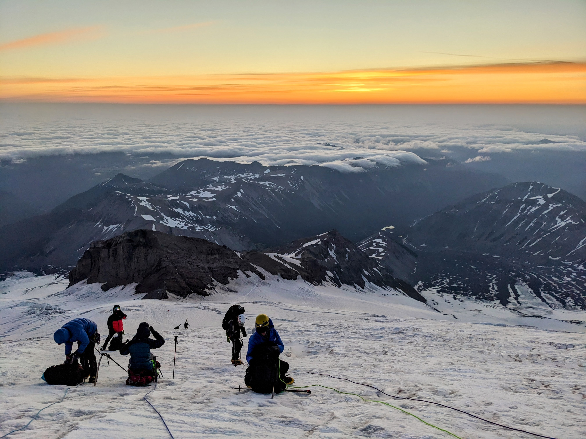

# quald

[](https://github.com/clintval/quald/actions/workflows/rust.yml)
[](https://coveralls.io/github/clintval/quald?branch=main)
[](https://www.rust-lang.org/)

Detect the quality encoding of FASTQ files using Rust.

```console
cargo add quald
```



```rust

```
